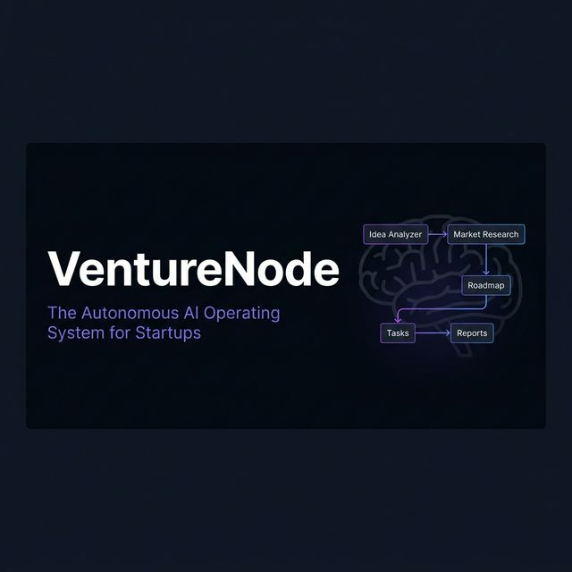

<div align="center">

<br />



<br />

# VentureNode

### The Autonomous AI Operating System for Startups

**An open-source, multi-agent AI system that turns a raw startup idea into a fully planned, researched, and tracked operation — all living inside your Notion workspace.**

<br />

[](https://opensource.org/licenses/MIT)
[](https://python.org)
[](https://nextjs.org)
[](https://fastapi.tiangolo.com)
[](https://github.com/langchain-ai/langgraph)
[](https://developers.notion.com)
[](https://groq.com)

<br />

[**View Demo**](#) · [**Read the Docs**](docs/architecture.md) · [**Report a Bug**](https://github.com/Prakhar2025/VentureNode/issues) · [**Request a Feature**](https://github.com/Prakhar2025/VentureNode/issues)

</div>

---

## The Problem

Early-stage founders operate in chaos. They work across scattered documents, vague market assumptions, shifting roadmaps, and task lists that die the moment they are written. Every tool in their stack — Notion, Jira, Trello — is **passive**. It waits to be told what to do.

**The average early-stage founder loses 4–6 hours a day** switching between planning, researching, and organizing rather than executing.

## The Solution

VentureNode changes the paradigm. It is not a template. It is not a chatbot. It is a **live, autonomous multi-agent system** that operates *inside* your Notion workspace — reading your intent, conducting research on the web, generating structured plans, and organizing your entire startup lifecycle without requiring manual delegation.

> Think of it as hiring a founding team of five AI specialists — a strategist, a market analyst, a product architect, a project manager, and an operations lead — and embedding them directly inside Notion.

---

## How It Works

VentureNode orchestrates a **stateful LangGraph pipeline** of five specialized agents. Each agent completes a discrete function and writes structured outputs into dedicated Notion databases. Humans remain in control via checkpoint approvals embedded directly as Notion checkboxes.

```
┌─────────────────────────────────────────────────────────────────┐
│                    VENTURENODE SYSTEM FLOW                       │
│                                                                   │
│  Founder submits idea via Dashboard                               │
│         │                                                         │
│         ▼                                                         │
│  ┌─────────────────┐                                             │
│  │  Idea Analyzer  │ → Scores clarity, risk, opportunity         │
│  └────────┬────────┘                                             │
│           │  ✅ Human Checkpoint: Approve in Notion              │
│           ▼                                                       │
│  ┌─────────────────┐                                             │
│  │ Market Research │ → Live OSINT via DuckDuckGo + BeautifulSoup │
│  └────────┬────────┘                                             │
│           │  ✅ Human Checkpoint: Approve in Notion              │
│           ▼                                                       │
│  ┌─────────────────┐                                             │
│  │ Roadmap Builder │ → Generates phased product milestones       │
│  └────────┬────────┘                                             │
│           │                                                       │
│           ▼                                                       │
│  ┌─────────────────┐                                             │
│  │  Task Planner   │ → Decomposes roadmap into actionable tasks  │
│  └────────┬────────┘                                             │
│           │                                                       │
│           ▼                                                       │
│  ┌─────────────────┐                                             │
│  │ Exec. Monitor   │ → Tracks progress and generates reports     │
│  └─────────────────┘                                             │
│                                                                   │
│  Everything is written to your Notion Workspace in real-time.    │
└─────────────────────────────────────────────────────────────────┘
```

---

## Key Differentiators

| | VentureNode | Generic Notion Templates | Simple AI Chatbots |
|---|---|---|---|
| **Multi-Agent Orchestration** | ✅ LangGraph stateful graph | ❌ | ❌ |
| **Live Market Research** | ✅ OSINT via DuckDuckGo | ❌ | ❌ |
| **Human-in-the-Loop** | ✅ Notion Checkbox Triggers | ❌ | ❌ |
| **Structured Notion Output** | ✅ Native Blocks + Databases | Partial | ❌ |
| **100% Free Stack** | ✅ Groq, FAISS, Open Source | N/A | ❌ |
| **Agent Memory (RAG)** | ✅ FAISS Vector Store | ❌ | ❌ |

---

## Architecture

```
venturenode/
├── backend/                  # Python FastAPI application
│   ├── agents/               # Individual AI agent implementations
│   │   ├── idea_agent.py
│   │   ├── research_agent.py
│   │   ├── roadmap_agent.py
│   │   ├── task_agent.py
│   │   └── exec_monitor_agent.py
│   ├── orchestrator/         # LangGraph workflow definition
│   │   └── graph.py
│   ├── notion/               # Notion MCP client & database wrappers
│   │   └── mcp_client.py
│   ├── memory/               # FAISS vector store integration
│   │   └── vector_store.py
│   ├── api/                  # REST endpoint routing
│   │   └── routes.py
│   ├── core/                 # Configuration, env management
│   │   └── config.py
│   └── main.py
│
├── frontend/                 # Next.js 14 dashboard
│   ├── app/                  # App Router pages
│   │   ├── page.tsx          # Main dashboard
│   │   ├── ideas/page.tsx    # Idea submission
│   │   ├── research/page.tsx
│   │   ├── roadmap/page.tsx
│   │   └── tasks/page.tsx
│   ├── components/           # Shared Shadcn + custom components
│   └── lib/
│       └── api.ts            # FastAPI communication layer
│
└── docs/                     # Architecture, API specs, guides
    ├── architecture.md
    └── notion-setup.md
```

---

## Tech Stack

### Backend
| Technology | Purpose |
|---|---|
| **Python 3.11+** | Core runtime |
| **FastAPI** | High-performance REST API layer |
| **LangGraph** | Stateful multi-agent orchestration |
| **LangChain** | Tool and agent primitives |
| **Groq** | Low-latency LLM inference (Llama 3.3-70b) |
| **DuckDuckGoSearchRun** | Free live OSINT for market research |
| **BeautifulSoup4** | Web scraping for competitor analysis |
| **FAISS** | Local vector store for agent memory |
| **Notion MCP / API** | Notion Workspace operations |

### Frontend
| Technology | Purpose |
|---|---|
| **Next.js 14 (App Router)** | React framework |
| **Tailwind CSS** | Utility-first styling |
| **Shadcn UI** | Premium component library |
| **Framer Motion** | Animation and micro-interaction layer |
| **Lucide React** | Icon system |

---

## Notion Workspace Structure

VentureNode writes fully structured, relational data to five interconnected databases:

| Database | Purpose |
|---|---|
| **Ideas** | Raw idea intake + AI scoring (Clarity, Risk, Opportunity) |
| **Research** | Live market intelligence, competitor summaries, trend data |
| **Roadmap** | Phase-by-phase product milestones |
| **Tasks** | Execution-ready tickets with priorities and deadlines |
| **Reports** | Weekly summaries, bottleneck reports, executive snapshots |

> See [docs/notion-setup.md](docs/notion-setup.md) for the exact property schema for each database.

---

## Quickstart

### Prerequisites
- Python 3.11+
- Node.js 18+
- A Notion account with an Internal Integration Token
- A Groq API Key (free at [console.groq.com](https://console.groq.com))

### 1. Clone & Configure

```bash
git clone https://github.com/Prakhar2025/VentureNode.git
cd venturenode
```

### 2. Backend

```bash
cd backend
python -m venv venv
source venv/bin/activate  # Windows: venv\Scripts\activate
pip install -r requirements.txt
```

Create `backend/.env`:
```env
NOTION_TOKEN=secret_xxxxxxxxxxxx
NOTION_IDEAS_DB_ID=xxxxxxxxxxxxxxxxxxxxxxxxxxxxxxxx
NOTION_RESEARCH_DB_ID=xxxxxxxxxxxxxxxxxxxxxxxxxxxxxxxx
NOTION_ROADMAP_DB_ID=xxxxxxxxxxxxxxxxxxxxxxxxxxxxxxxx
NOTION_TASKS_DB_ID=xxxxxxxxxxxxxxxxxxxxxxxxxxxxxxxx
NOTION_REPORTS_DB_ID=xxxxxxxxxxxxxxxxxxxxxxxxxxxxxxxx
GROQ_API_KEY=gsk_xxxxxxxxxxxxxxxxxxxx
```

```bash
uvicorn main:app --reload
```

### 3. Frontend

```bash
cd frontend
npm install
cp .env.example .env.local
npm run dev
```

Navigate to `http://localhost:3000`.

---

## Roadmap

- [x] Phase 0: Project scaffolding and documentation
- [ ] Phase 1: FastAPI backend and Notion MCP integration
- [ ] Phase 2: LangGraph agent orchestration (5 specialized agents)
- [ ] Phase 3: Next.js dashboard with Shadcn UI
- [ ] Phase 4: Full end-to-end integration and testing
- [ ] Phase 5: GitHub Actions CI/CD pipeline
- [ ] Phase 6: Multi-workspace support and team collaboration

---

## Contributing

Contributions are welcome. Please open an issue first to discuss what you would like to change. See the [Contributing Guidelines](CONTRIBUTING.md) for details.

---

## License

MIT — see [LICENSE](LICENSE) for details.

---

<div align="center">
  <sub>Built for the <a href="https://dev.to/challenges/notion">Notion MCP Challenge</a> · Powered by open-source.</sub>
</div>
